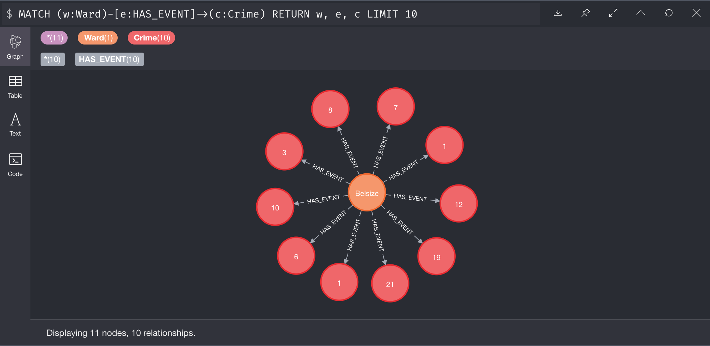

# Next Steps
Thus far, we have explored crime data using descriptive statistics and mapping techniques. However, we can iterate on this to further address possible user-needs that we brainstormed in the intro. In particular, we could:

1. Analyse the crime outcome data, so we understand crime and how it is being investigated.
1. Build on the interactive map to be a [bokeh](https://docs.bokeh.org/en/latest/docs/gallery.html) dashboard or [flask](https://flask.palletsprojects.com/en/1.1.x/) app. We can include further plots alongside the map, such as the time-series plots. Indeed, we can embed time-series plots on the markers upon the user-clicking, similar to what is seen on the [Quick Start guide](https://python-visualization.github.io/folium/quickstart.html).
    + As part of this, we can work with users to brainstorm KPIs which decision-makers can use to assess the performance of policy-measures to combat crime.
1. Model our crime data to understand the *causes* of crime within Camden and its wards. This can start off with a simple linear regression model to assess what factors can impact crime rates.
   + In particular, have street-light data and one hypothesis that has been proposed before is whether more street-lighting can reduce crime rates, particularly around night when it is dark. This hypothesis can be explored as we have street-light data.
        - If we find that street-lighting does impact crime rates significantly, then an policy question would be how you can optimise the number and distance of street lights within each ward to reduce this. A geo-spatial model can then be used for this.
        - This does depend on us having the data with timestamps though, so we can distinguish between crime that occurs during daylight and night-time.
1. Model our crime data to *forecast* levels of crime in the future, and how they compare across wards so law enforcement can prudently deploy resources and plan ahead. As we are using crime-rates, this would involve building a compositional time-series model so moving-average (MA), autoregressive (AR) and Autoregressive Integrated Moving Average (ARIMA) models can be explored.
    + Related to this, we can build a structural break model using Chow-tests and Kullback-Liebler divergence test to assess whether policy interventions on crime have had a significant impact on crime-rates.

1. Utilise graph databases and algorithms to model this geo-spatial data.
    + This ties in with (3.) where we can use a geo-spatial model to find the optimum number of street-lights and their distances from each other to reduce crime rates.
    + A graph-approach to modelling and visualising the data can also act as a visual aid to abstract away from the complexity associated with maps and thereby focus the audience's attentions to the relationships between nodes such as crime and street-lights.
    + You could take a graph-approach to assess whether there is a relationship between wards with high-crime rates and are geographically-close (through a weighted relationship).
    + A starter script to import this data and visualise it in [neo4j Sandbox](https://neo4j.com/sandbox/), a cloud-hosted instance of neo4j's graph database, is provided in `data/neo4j/crime_lamp.cypher`. It has been imported and visualised. You can have a go by setting-up a free instance and importing the data in. (*An example is found below*)

***
## Graph database



```cypher
MATCH (w:Ward)-[e:HAS_EVENT]->(c:Crime)
RETURN w, e, c
LIMIT 10;
```
